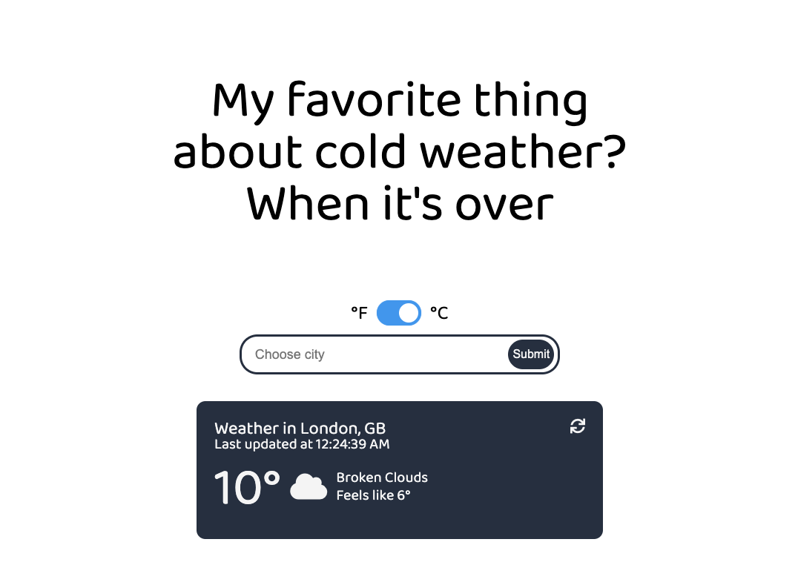

# js-weather-app

# Toxic Weather App

> A Javascript app that allows the user to look for the weather conditions anywhere in the world via OpenWeather's API and, depending on the weather provides "toxic" comment.



## Built With

- Javascript
- Webpack
- OpenWeather API
- HTML
- CSS

## Live Demo

A live demo is not available due to privacy of API key and this project is run on client-side.

## Getting Started

To get a local copy up and running follow these simple example steps.

An [Open Weather API Key](https://openweathermap.org/appid#get) is required for running this project.
- Clone this repository with: 
`git clone https://github.com/bettercallazamat/js-weather-app.git`
- Navigate to the project folder (js-weather-app)
- Create a `src/config.js` file, set your OpenWeatherMap api key there and export it: 
``` 
const config = {
    API_KEY: 'your open weather map API key';
}

export default config;
```
- Run `npm install`.
- Run `npm build`.
- Open the file `dist/index.html` with the browser.

## Author

👤 **Azamat Nuriddinov**

- Github: [@bettercallazamat](https://github.com/bettercallazamat)
- Twitter: [@azamat_nuriddin](https://twitter.com/azamat_nuriddin)
- Linkedin: [Azamat Nuriddinov](https://www.linkedin.com/in/azamat-nuriddinov-57579868)

## 🤝 Contributing

Contributions, issues and feature requests are welcome!

## Show your support

Give a ⭐️ if you like this project!

## 📝 License

This project is [GNU](lic.url) licensed.